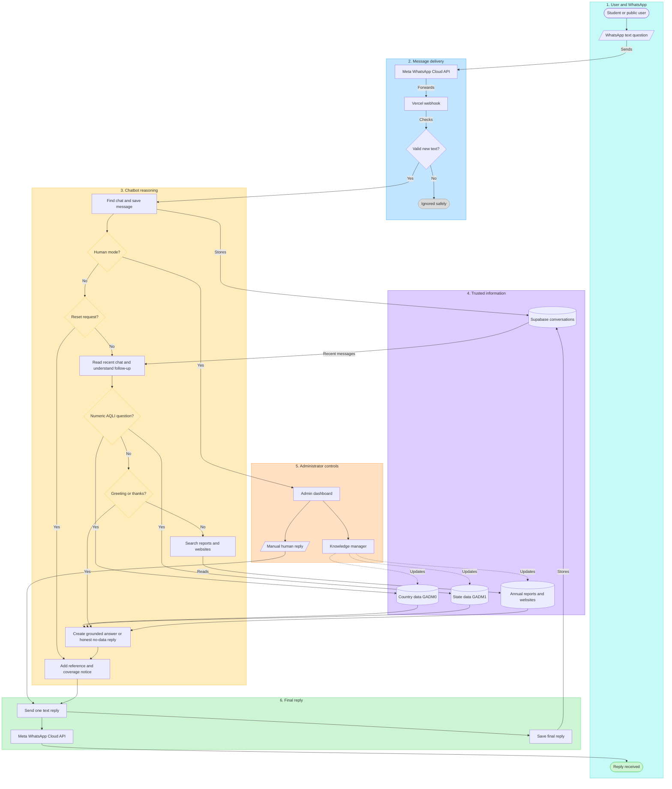

# How the AQLI WhatsApp Chatbot Works

This flowchart explains the complete journey of a message in simple language, from the user's question to the final WhatsApp reply.

## Simple Explanation

1. A user types a text question in WhatsApp.
2. Meta's WhatsApp Cloud API sends the message to the chatbot's Vercel webhook.
3. The chatbot checks that it is a new text message, finds or creates the conversation, and saves the message in Supabase.
4. In **Human mode**, automatic answering stops and an administrator can reply from the dashboard.
5. In **AI mode**, the bot first checks for `reset`, then uses recent messages to understand follow-up questions such as “What about Bihar?”
6. Numeric questions about values, rankings, comparisons, thresholds, or trends use structured country data (GADM0) and state/province data (GADM1).
7. Explanation and methodology questions search active annual reports, methodology files, and imported website content. Greetings and thanks receive short natural replies.
8. The bot creates a grounded answer. If the available sources do not support an answer, it says that the data is unavailable instead of guessing.
9. Every automated answer receives a source reference and a notice that current structured coverage is country and state/province level only.
10. The final reply is sent once through Meta, delivered to the user, and saved in Supabase.

## Important Points

- Current structured data covers countries and states/provinces through 2024.
- District-level structured data is not currently active.
- The webhook automatically processes text messages only.
- Sending `reset` clears active conversation context, but it does not delete stored messages.
- Administrators can upload replacement CSVs, reports, documents, and website content through the Knowledge Manager.
- OpenRouter may improve the wording of report-based answers, but the bot rejects unsupported output and uses a grounded fallback.
